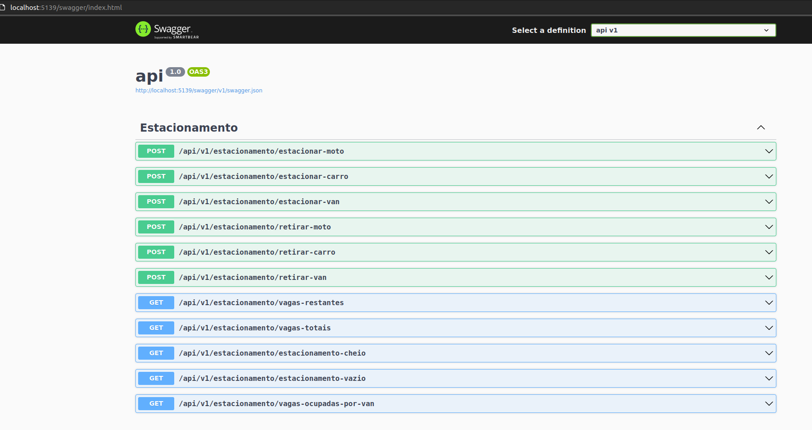

## Instruções
Olá, candidato! Bem-vindo à sua entrevista. O boilerplate é fornecido. Sinta-se à vontade para alterar o código da forma que melhor. Para executar o código a qualquer momento, pressione o botão de execução localizado no canto superior esquerdo.

## Objetivos: projetar um estacionamento usando princípios orientados a objetos

### Aqui estão alguns métodos que você deve ser capaz de executar:

- Diga-nos quantas vagas restam
- Diga-nos quantas vagas totais há no estacionamento
- Diga-nos quando o estacionamento estiver cheio
- Diga-nos quando o estacionamento estiver vazio
- Diga-nos quando certos lugares estão cheios, por exemplo quando todas as vagas de moto são ocupadas
- Diga-nos quantas vagas as vans estão ocupadas

## Orientações:

- O estacionamento pode acomodar motos, carros e vans
- O estacionamento tem vagas para motos, vagas para carros e vagas grandes
- Uma moto pode estacionar em qualquer lugar
- Um carro pode estacionar em uma única vaga para carro, ou em uma vaga grande
- Uma van pode estacionar, mas ocupará 3 vagas de carro, ou uma vaga grande

Essas são apenas algumas orientações. Sinta-se à vontade para perguntar ao seu entrevistador sobre mais, conforme necessário


## Resolução:

Para resolver o desafio implementei uma API utilizando .Net Core 7 e fixei o total de vagas do estacionamento em 100 vagas

Para alterar o total de vagas basta mudar a linha 13 do arquivo EstacinamentoController.cs
```cs
private static readonly Estacionamento _estacionamento = new (100);
```

Vemos na imagem abaixo o print da tela inicial da API (utilizando Swagger) com todas as rotas.

